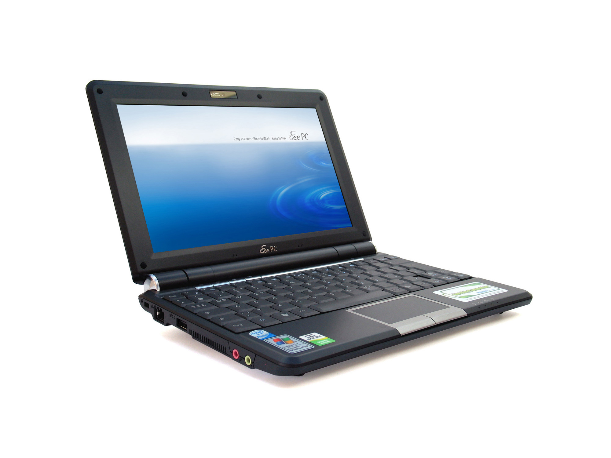

## Tilelook | VBL | VR/AR
---
### Tilelook ~ PC běžného uživatele
- Intel  i3 / i5, 3. nebo 4. generace (ročník 2013+)
- Intel HD 4000 nebo novější (ročník 2013+)
- nVidia GeForce 340 nebo novější (ročník 2010+)
- 4GB > 8GB RAM
- FullHD rozlišení 1980x1050
- Operační systém Windows 7 / 10
---
### Tilelook ~ extrémní PC
- Asus EEE PC
  - Intel Atom 1.6GHz, Intel GMA 900, 1GB RAM, 1024x600, Windows XP

---
- Intel Xeon (více fyzických jader)
- nVidia GeForce 1080Ti
- 32GB RAM
- 4k rozlišení 3840x2160
- Windows 10